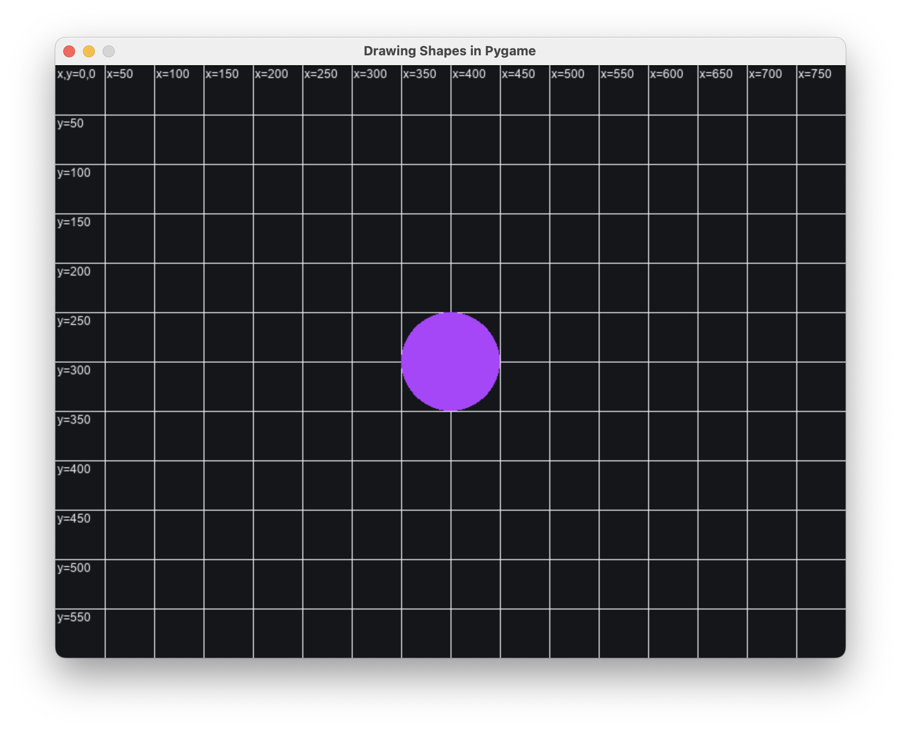

# Drawing Shapes in Pygame

<style>
    .container {
        display: flex;
        flex-wrap: wrap;
        align-items: center;
        justify-content: center;
        gap: 20px;
        text-align: center;
    }

    .image-container, .button-container {
        flex: 1 1 100%; /* Default: Full width */
    }

    .image-container img {
        max-width: 100%;
        height: auto;
    }

    @media (min-width: 768px) { /* Side-by-side on larger screens */
        .container {
            flex-wrap: nowrap; /* Prevent wrapping */
            text-align: left; /* Align text properly */
        }
        .image-container, .button-container {
            flex: 0 1 auto; /* Side by side */
        }
    }
</style>

<div class="container">
    <!-- Image -->
    <div class="image-container">
        
    </div>

    <!-- Download Button -->
    <div class="button-container">
        <a href="../draw_shapes.py" download class="md-button md-button--primary">
            ⬇ Download draw_shapes.py
        </a>
    </div>
</div>

### The Pygame Coordinate System

A coordinate system is used to place objects on the screen.  It's important to know how pygame's coordinate systems works.

- **(0,0) is in the top-left corner** of the screen.
- As **x increases**, the position moves **to the right**.
- As **y increases**, the position moves **downward**.

To help visualize this, this example draws a **grid** in 50-pixel increments, with labels marking x and y positions.

{width="500"}

## Drawing Shapes in Pygame

Pygame provides built-in functions to draw various shapes and every shape is placed using **coordinates**. A coordinate is a pair of numbers **(x, y)** that tells us where something is on the screen.

- The **x-value** represents the **horizontal position** (left to right).
- The **y-value** represents the **vertical position** (top to bottom).
- Coordinates are always written as **(x, y)** in parentheses.

### Available Shapes:
#### **Rectangle (`pygame.draw.rect`)**
   ```python
   pygame.draw.rect(SCREEN, ORANGE, (50, 50, 200, 100))
   ```
   {width="250"}

   - Draws a rectangle at coordinate **(50,50)**
   - with a Width = **200**, and a Height = **100**

#### **Circle (`pygame.draw.circle`)**
   ```python
   pygame.draw.circle(SCREEN, PURPLE, (400, 300), 50)
   ```
   {width="250"}

   - Draws a circle with a center at coordinate = **(400,300)**
   - with a Radius = **50**

#### **Line (`pygame.draw.line`)**
   ```python
   pygame.draw.line(SCREEN, GREEN, (100, 500), (700, 500), 5)
   ```
   - Starts at **(100,500)**, ends at **(700,500)**
   - Line thickness = **5 pixels**

#### **Polygon (`pygame.draw.polygon`)**
   ```python
   pygame.draw.polygon(SCREEN, PURPLE, [(600, 100), (650, 200), (550, 200)])
   ```
   - Connects points **(600,100)**, **(650,200)**, and **(550,200)** to form a triangle.

#### **Ellipse (`pygame.draw.ellipse`)**
   ```python
   pygame.draw.ellipse(SCREEN, ORANGE, (300, 400, 150, 80))
   ```
   - Fits inside a bounding box at **(300,400)**
   - Width = **150**, Height = **80**

## Challenges
Try modifying the code to place the shapes in different locations:

1. Move the **rectangle** to **(100,100)** and double its size.
2. Change the **circle’s position** so it appears in the **bottom-right corner**.
3. Make the **line diagonal**, starting from **(0,0)** to **(800,600)**.
4. Adjust the **triangle** to form a different shape by modifying the points.