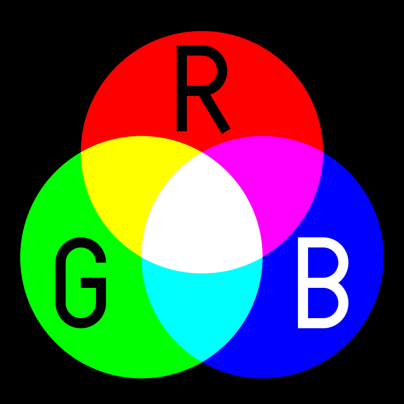

# Understanding RGB Colors


<style>
    .container {
        display: flex;
        flex-wrap: wrap;
        align-items: center;
        justify-content: center;
        gap: 20px;
        text-align: center;
    }

    .image-container, .button-container {
        flex: 1 1 100%; /* Default: Full width */
    }

    .image-container img {
        max-width: 100%;
        height: auto;
    }

    @media (min-width: 768px) { /* Side-by-side on larger screens */
        .container {
            flex-wrap: nowrap; /* Prevent wrapping */
            text-align: left; /* Align text properly */
        }
        .image-container, .button-container {
            flex: 0 1 auto; /* Side by side */
        }
    }
</style>

<div class="container">
    <!-- Image -->
    <div class="image-container">
        
    </div>

    <!-- Download Button -->
    <div class="button-container">
        <a href="../color_mixer.py" download class="md-button md-button--primary">
            ⬇ Download color_mixer.py
        </a>
    </div>
</div>


Download and Run the `color_mixer.py` to learn how colors are represented in python.

1. The game displays **three circles** representing red, green, and blue.
2. A **final color circle** represents their combined value.
3. You can adjust each color component using the **R, G, and B keys**, with Shift to increase and lowercase to decrease.
4. The numbers inside the circles show the current intensity of each color.

By adjusting these values, you can see how **RGB color mixing** works in real-time!

## What is RGB?
RGB stands for **Red, Green, and Blue**. It is an additive color model used to represent colors on digital screens. Each color on a screen is created by combining different intensities of red, green, and blue light. The combination of these three primary colors can produce millions of different colors.

RGB is an **additive** system, meaning that the more light you add, the brighter the color becomes.  

{width=250}

_Above: Red, Green, and Blue lights mix to create new colors._

RGB colors are often represented as **tuples** in Python, such as:
```python
(255, 0, 0)  # Red
(0, 255, 0)  # Green
(0, 0, 255)  # Blue
(255, 255, 0)  # Yellow
(0, 255, 255) # Pink
(255, 255, 255)  # Solid White
(0, 0, 0)  # Solid Black
```

By adjusting the values of red, green, and blue, we can create any color that our eyes can perceive. 

Each color channel can range from **0** (no intensity) to **255** (full intensity), meaning there are **16,777,216** possible colors (256 × 256 × 256).

!!! note "Tuples in Python"
    A **tuple** is an ordered collection of values that cannot be changed after creation. 

    Think of it like **(x, y) coordinates** on a graph or **(R, G, B)** values in a color system.

    For example, an **RGB color** is represented as a tuple:
    
    - **First value** → Red intensity (0 to 255)  
    - **Second value** → Green intensity (0 to 255)  
    - **Third value** → Blue intensity (0 to 255)  

    ```python
    color = (255, 0, 0)  # Red color
    ```

    Since tuples are **immutable**, their values cannot be changed after they are assigned.

## Challenge
Try changing the values and see how different colors form. What happens when:

- All values are the same?
- One value is at max while the others are at zero?
- You mix two primary colors?

